# Baseline Environment Configuration

## Overview

This section documents the initial infrastructure configuration of the AWS environment prior to any security testing. The environment was intentionally designed with a secure baseline so that all later findings result from controlled misconfigurations rather than setup errors.

## Environment Details

- **Region:** `us-west-2`
- **Naming standard:** `aws-sec-lab-*`

## Network Configuration

### VPC

A VPC was configured to isolate cloud resources and control network traffic within a defined private address range.

- **VPC CIDR:** `10.0.0.0/16`

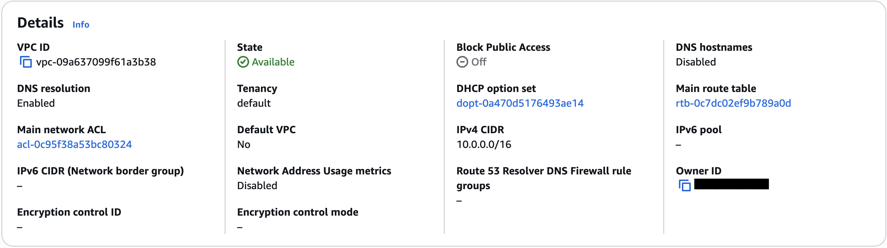

### Subnets

The VPC contains two subnets:

- **Public subnet:** `10.0.1.0/24`
- **Private subnet:** `10.0.2.0/24`

The public subnet hosts the EC2 instance. The private subnet currently has no deployed resources and exists to demonstrate segmentation and how internal workloads would be isolated in a more production-oriented design.

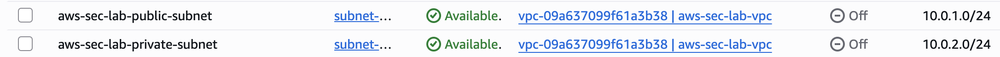

### Route Table

A route table was configured for the public subnet with:

- `0.0.0.0/0 -> Internet Gateway`
- `10.0.0.0/16 -> Local`

This enables internet connectivity for the EC2 instance while preserving local communication inside the VPC.

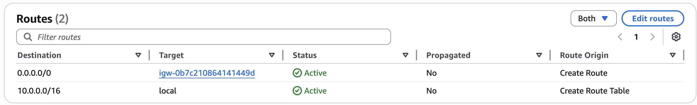

### Network ACLs

Default network ACLs were used, allowing all inbound and outbound traffic. Traffic control was primarily enforced using security groups.

## Compute Configuration

### EC2 Instance

An EC2 instance was deployed in the public subnet to support controlled security testing.

- **Instance type:** `t3.micro`
- **Placement:** Public subnet
- **Access:** SSH restricted to a trusted IP address

The EC2 instance was placed in the public subnet so the lab could simulate real-world exposure scenarios such as open ports and unauthorized access attempts. In a production environment, sensitive workloads would generally be placed in a private subnet.

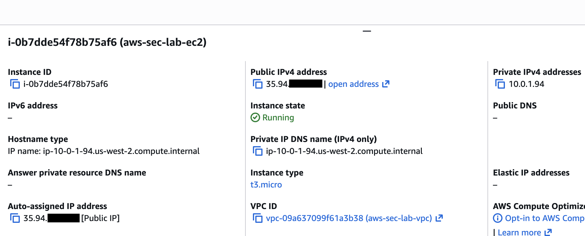

The security group initially allowed SSH access only from a trusted IP address.

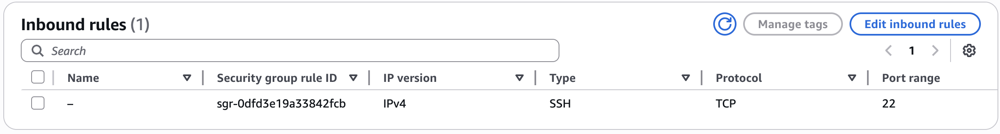

The networking configuration confirmed placement in the public subnet and the presence of both public and private addressing.

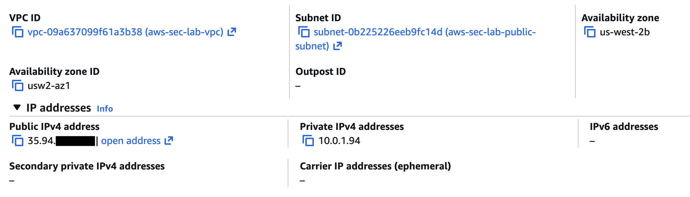

### SSH Setup Note

Initial SSH access to the EC2 instance failed due to local private key file permissions. This was corrected by applying restrictive file permissions using `chmod 400`, allowing secure authentication.

## Storage Configuration

### S3 Bucket

The S3 bucket was configured as a private storage resource for testing access control scenarios.

- **Public access:** Fully blocked
- **Objects:** Sample object uploaded for testing

> Important: S3 is a regional AWS service and is not deployed inside the VPC.

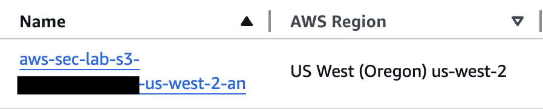

## Identity and Access Management

### EC2 Role

A dedicated IAM role was created and attached to the EC2 instance:

- **Role name:** `aws-sec-lab-ec2-role`
- **Purpose:** Provide secure, temporary access to required AWS resources without hardcoded credentials

The attached custom policy provided read-only access to the designated S3 bucket, following the principle of least privilege.

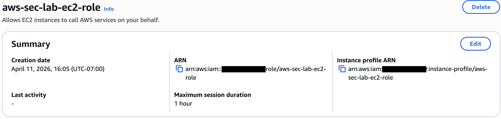

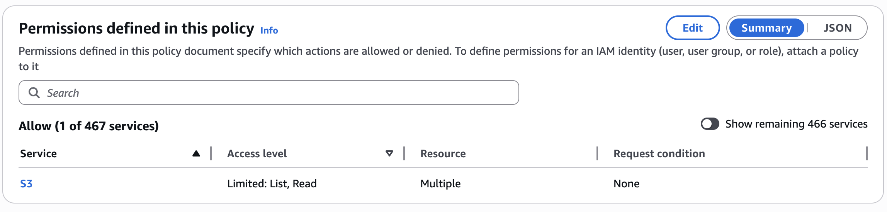

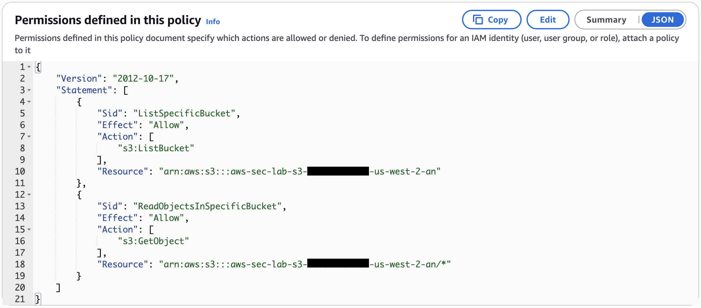

## Monitoring and Logging

### CloudTrail

CloudTrail was enabled to log management events and store audit logs in a dedicated S3 bucket separate from application data. This helps preserve audit evidence and improve traceability.

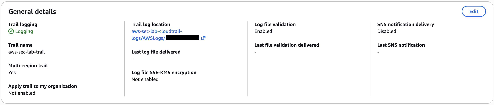

### AWS Config

AWS Config was enabled to record resource configurations and support compliance monitoring. The environment included the following rules:

- `s3-bucket-level-public-access-prohibited`
- `s3-bucket-public-read-prohibited`

### CloudWatch

CloudWatch was enabled to provide visibility into metrics and support monitoring familiarity within the environment.

## Baseline Security State

Before initiating any security tests, the environment was verified to be secure:

- S3 bucket access fully restricted
- Security groups limited SSH access to a trusted IP
- IAM role followed least-privilege principles
- CloudTrail logging active
- AWS Config recording resource configurations

This baseline ensured that all later security findings were the result of intentional misconfiguration rather than setup issues.
