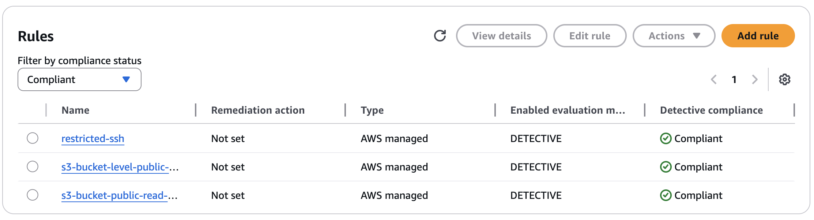

# AWS Config

## Purpose

AWS Config was enabled to record configuration changes across key resources and support compliance-oriented monitoring. It was used to identify non-compliant resource states during testing and to validate that remediations successfully restored compliant configurations.

## Recorded Resource Types

AWS Config was used to track changes across key resources including:

- EC2 instances
- S3 buckets
- IAM roles
- Security groups

## Baseline Evidence

## Rules Used

### S3 Rules

- `s3-bucket-level-public-access-prohibited`
- `s3-bucket-public-read-prohibited`

These rules were used to detect the S3 public exposure scenario.

### Security Group Rule

- `restricted-ssh`

This rule was used to detect the open port exposure scenario where SSH was opened to `0.0.0.0/0`.

## Observed Limitation

AWS Config did **not** automatically flag the IAM over-permission scenario. This highlights a real limitation in configuration-based compliance tooling: IAM over-privilege often requires manual review or additional tools such as IAM Access Analyzer.
