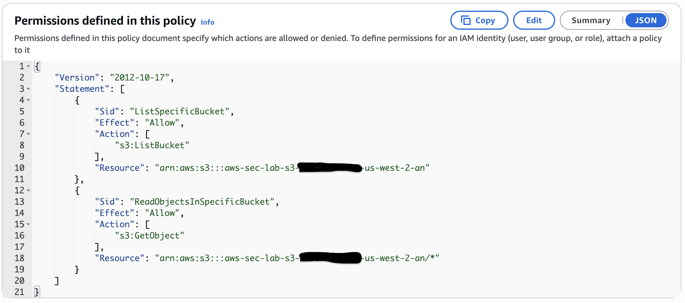
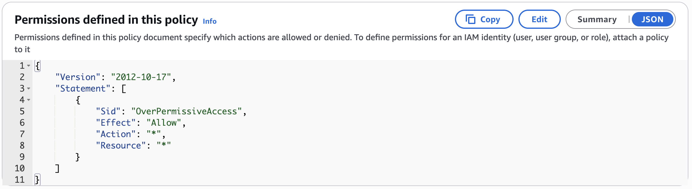
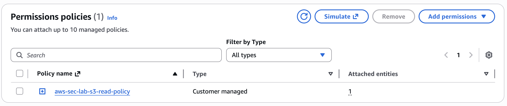
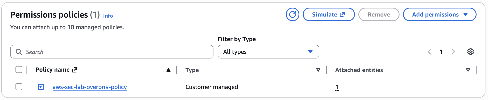
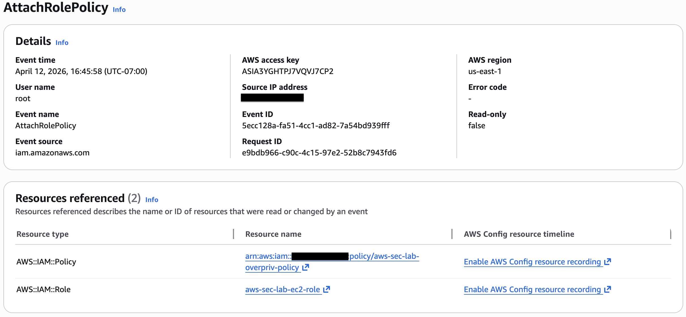
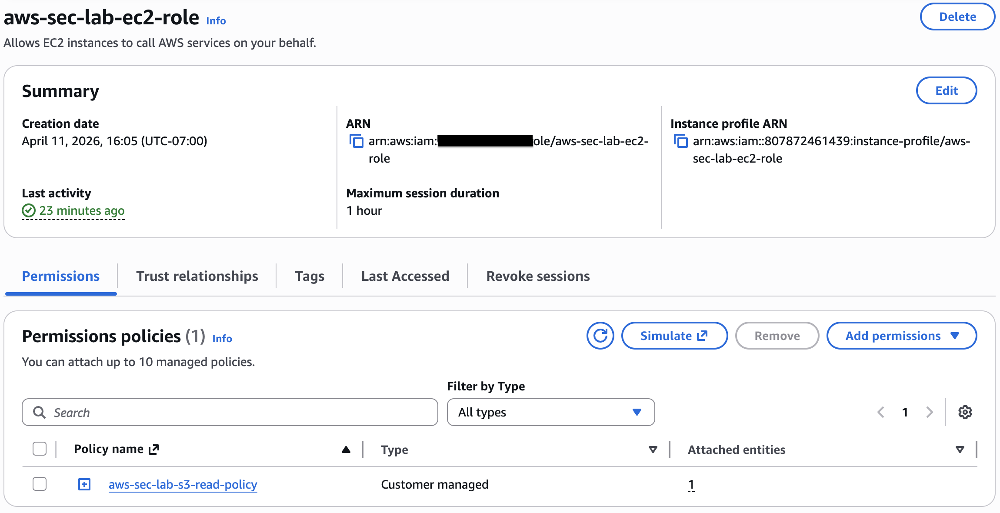

# IAM Over-Permission

## Objective

Simulate excessive IAM permissions to evaluate the risks associated with over-privileged roles, assess detection capabilities, and validate remediation processes in a cloud environment.

## Baseline State

Prior to this test, the IAM role (`aws-sec-lab-ec2-role`) was configured following least-privilege principles, with permissions limited to read-only access for a specific S3 bucket. No excessive or wildcard permissions were present.

## Misconfiguration

The following intentional misconfiguration was introduced:

An over-permissive IAM policy was created and attached to the EC2 role, granting unrestricted access across all AWS services.

**Policy configuration:**

- `Action: *`
- `Resource: *`

This resulted in the EC2 role having administrative-level access, violating the principle of least privilege.

## Risks

- **Privilege escalation** - Any compromised resource gains full access
- **Unauthorized modification** - Resources can be altered or deleted
- **Data exposure** - Sensitive data across services becomes accessible
- **Loss of control** - The broader AWS environment can be impacted
- **Lateral movement risk** - Compromised roles can be used to access and manipulate other AWS resources

## Detection

### AWS Config

No specific rule flagged this misconfiguration, highlighting a limitation in configuration-based detection for IAM over-permission scenarios.

### CloudTrail

CloudTrail captured the API call responsible for the misconfiguration, including the user identity, timestamp, and action performed. This provided traceability and supported audit analysis.

Due to the global nature of IAM, these events were recorded in `us-east-1` rather than the primary deployment region. This highlights the importance of reviewing logs across regions when investigating identity-related activity.

This also demonstrates that while CloudTrail provides visibility into identity-related changes, identifying over-permission scenarios often requires manual analysis or additional tools.

## Remediation

The misconfiguration was resolved by:

- Detaching the over-permissive policy from the EC2 role
- Restoring the original least-privilege policy configuration
- Verifying that no wildcard (`*`) permissions remained attached to the role

These steps ensured the role was returned to a secure, limited-access state.

## Validation

After remediation, the IAM role permissions were reviewed and confirmed to only include the intended least-privilege access. No wildcard actions or overly broad permissions remained.

## Lessons Learned

- Overly broad IAM permissions create significant security risk
- Least privilege is critical for limiting blast radius
- IAM misconfigurations may not always be automatically detected
- Manual review and monitoring are essential

## Production Improvements

- Enforce least-privilege policies
- Use IAM Access Analyzer
- Implement permission boundaries
- Regularly audit IAM roles
