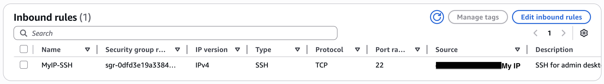
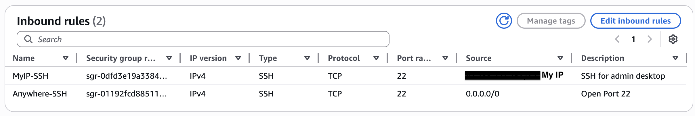
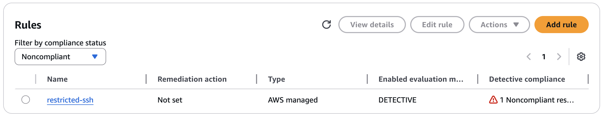
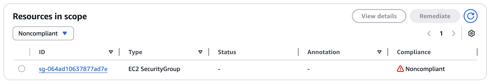
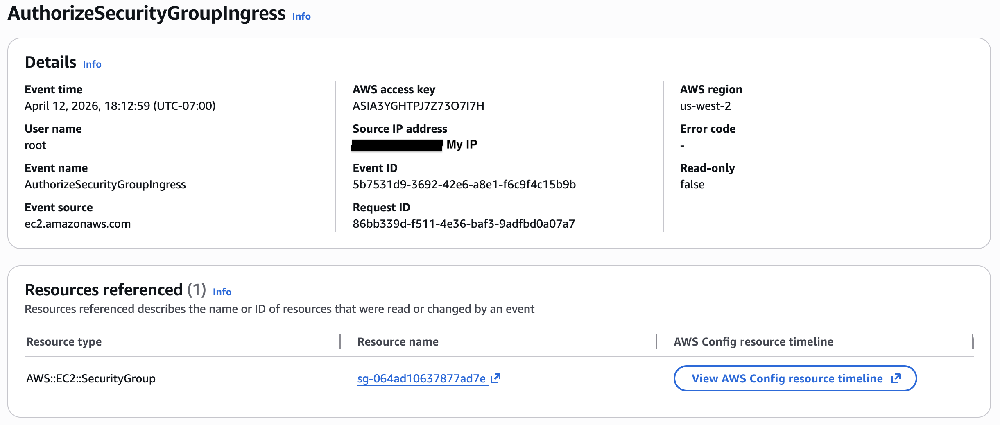

# Open Port Exposure

## Objective

Simulate a security group misconfiguration by exposing SSH access to the public internet, evaluate associated risks, and validate detection and remediation processes.

## Baseline State

The security group was initially configured to allow SSH access only from a trusted IP address, limiting exposure to authorized users.

## Misconfiguration

The following intentional misconfiguration was introduced:

The inbound SSH rule was modified to allow access from `0.0.0.0/0`, exposing the instance to the public internet.

This change significantly increased the attack surface of the EC2 instance.

## Risks

- **Unauthorized access attempts** - Attackers can attempt SSH connections from anywhere
- **Brute force attacks** - Increases the likelihood of credential guessing attempts
- **Exposure to scanning** - Publicly open ports are commonly scanned by automated tools
- **Increased attack surface** - The instance becomes more visible to the internet and potential attackers

## Detection

### AWS Config

AWS Config flagged the security group as **NON_COMPLIANT** under the `restricted-ssh` rule, identifying that SSH access was allowed from an unrestricted source.

### CloudTrail

CloudTrail recorded the `AuthorizeSecurityGroupIngress` event, capturing the user, timestamp, and rule change. This demonstrates that CloudTrail can capture network-level configuration changes and provide traceability for security group modifications.

## Remediation

The misconfiguration was resolved by:

- Removing the unrestricted SSH rule
- Restoring access to only a trusted IP address

These steps reduced exposure and returned the instance to a secure state.

## Validation

After remediation, the security group was verified to restrict SSH access to a trusted IP address, and AWS Config returned the resource to a **COMPLIANT** state, confirming that the exposure was successfully resolved.

## Lessons Learned

- Publicly exposed ports significantly increase attack surface
- Security groups act as a critical first line of defense
- Misconfigurations can be easily introduced and must be continuously monitored
- Automated tools like AWS Config are valuable for detecting network exposure
- Network-level misconfigurations can expose resources even when application and IAM security controls are properly configured

## Production Improvements

- Enforce restricted access policies for SSH
- Use bastion hosts instead of direct public access
- Implement automated alerts for security group changes
- Regularly audit network configurations
