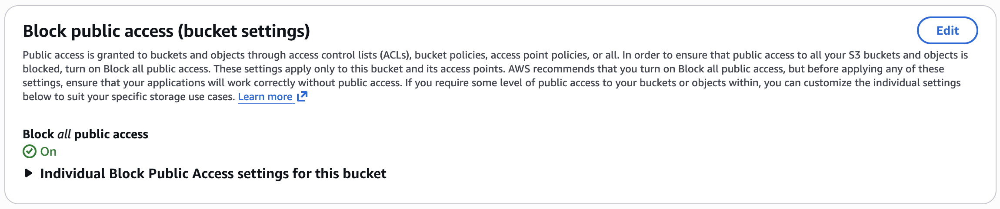
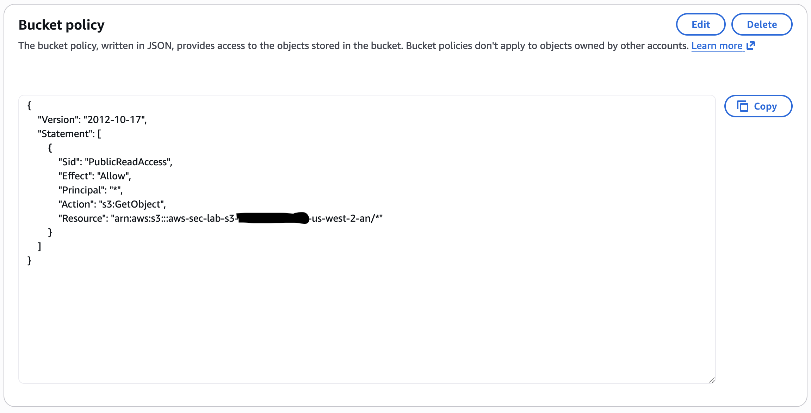
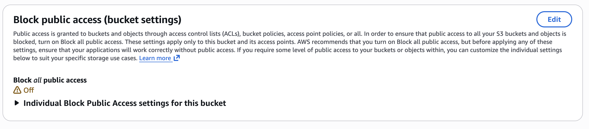
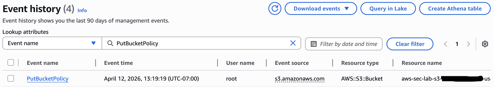
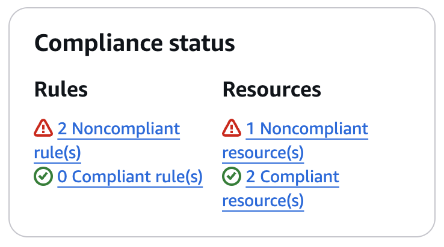
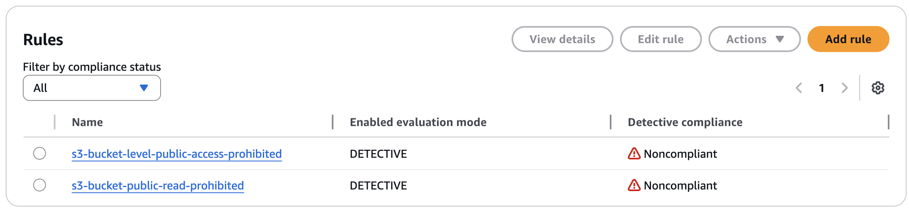
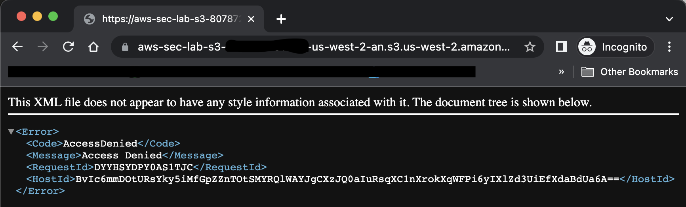
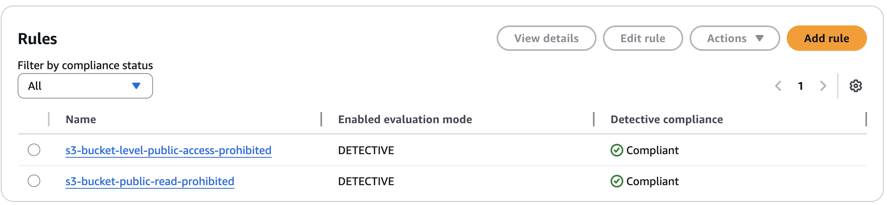

# S3 Public Exposure

## Objective

The purpose of this test was to simulate a common cloud storage misconfiguration by exposing an S3 bucket to public access. This test evaluates the associated risks, demonstrates how such misconfigurations can be detected using AWS-native tools, and validates the effectiveness of remediation steps.

## Baseline State

Prior to this test, the S3 bucket had all public access blocked and no public policies applied. This ensured the environment was secure before introducing the misconfiguration.

## Misconfiguration

The following intentional misconfigurations were introduced:

1. The **Block all public access** setting was disabled.
2. A bucket policy was applied that allowed any principal to read any object in the bucket.

This caused the bucket contents to become publicly accessible.

The bucket was then validated from a public-access perspective.

## Risks

This misconfiguration introduced several critical security risks:

- **Unauthorized data access** - Any user on the internet could access objects without authentication
- **Data exposure** - Sensitive or internal data could become publicly accessible
- **Compliance violations** - Public access may violate security frameworks such as HIPAA or NIST
- **Lack of accountability** - Since access is anonymous, actions cannot be traced to specific users

## Detection

### CloudTrail

CloudTrail captured the API call responsible for the misconfiguration, including the user identity, timestamp, and action performed. This provided traceability and supported audit analysis.

### AWS Config

AWS Config flagged the S3 bucket as **NON_COMPLIANT** under the following rules:

- `s3-bucket-public-read-prohibited`
- `s3-bucket-level-public-access-prohibited`

These findings directly identified the affected resource and the violated compliance controls.

## Remediation

The misconfiguration was resolved by:

- Removing the public bucket policy that allowed unrestricted access
- Re-enabling **Block all public access**
- Verifying that objects were no longer publicly accessible

These steps restored the bucket to a secure state.

## Validation

After remediation, attempts to access objects through a public URL resulted in access denied behavior, confirming that public access had been removed and the bucket was restored to a secure state.

## Lessons Learned

- S3 buckets are highly sensitive to configuration changes, and small misconfigurations can lead to significant exposure
- Public access can be introduced easily through policy changes, even if initial settings are secure
- Continuous monitoring through tools like CloudTrail and AWS Config is critical for detecting security issues
- Enforcing least-privilege access and default-deny configurations is essential to maintaining a secure cloud environment

## Production Improvements

In a production environment, additional controls would be implemented, including:

- Enforcing S3 Block Public Access at the account level
- Implementing automated alerts for bucket policy changes
- Using service control policies (SCPs) to prevent public exposure
- Regular compliance reviews using AWS Config rules
